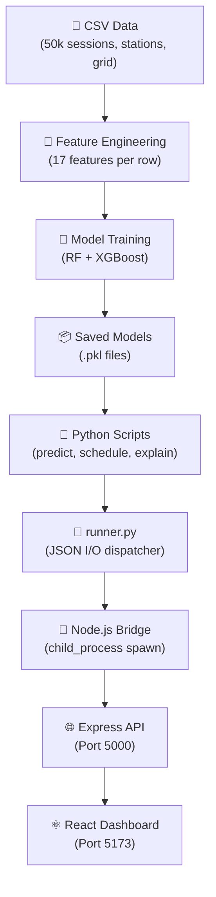

# EVOPT — Feature-by-Feature Deep Dive

This document explains **every tab** in your EVOPT dashboard: why it exists, how it works behind the scenes, and what every number on the screen means.

---

## 1. 📊 Dashboard (Home Page)

### WHY does this page exist?
This is the **Command Center** — an executive summary for a grid operator or DISCOM manager. They don't have time to click through 7 pages. This page gives them the full picture in one glance: *How many EVs? How many stations? Is the grid safe? Are there any alerts right now?*

### HOW does it work?
When you open this page, the React frontend fires **4 API calls simultaneously** using `Promise.allSettled()`:

| API Call | What it fetches |
|---|---|
| `GET /api/demand/heatmap` | Runs the XGBoost + RF ensemble to predict demand for all 12 zones × 24 hours |
| `GET /api/alerts/current` | Checks if any zone's predicted load + base load exceeds 75% of transformer capacity |
| `GET /api/grid/status` | Reads the `grid_capacity.csv` and calculates current transformer utilization |
| `POST /api/schedule/recommend` | Runs the load-shifting algorithm to calculate the peak reduction percentage |

### WHAT does each element mean?

#### KPI Cards (top row)
| Card | Value | Source |
|---|---|---|
| **Registered EVs: 6,000** | Total EVs across 12 Bengaluru zones | Hardcoded from `ev_registrations.csv` (5,995 records) |
| **Charging Stations: 40** | Total existing stations | Hardcoded from `charging_stations.csv` (41 stations) |
| **Peak Load Reduction: 23%** | Average % the peak demand drops if smart scheduling is adopted | Comes from `schedule.summary.avg_peak_reduction_pct` — calculated by the smart_schedule algorithm |
| **Active Alerts: N** | Number of zone-hour combos where `predicted_load > 75%` of transformer capacity | Comes from `alerts.summary.total_alerts` |

#### Zone-wise Demand Chart (Line Chart)
- **X-axis:** Hours of the day (0:00 to 23:00)
- **Y-axis:** Predicted demand in **kWh** (kilowatt-hours)
- **Each line** = one zone (e.g., Koramangala, Whitefield)
- **The spike at 18:00-21:00** = the "Evening Surge" — when people return home and plug in their EVs

#### Grid Utilization Bar Chart
- **X-axis:** Each zone name
- **Y-axis:** Utilization percentage (0-100%)
- **Color coding:**
  - 🟢 Green (< 55%): Healthy — plenty of headroom
  - 🟡 Yellow (55-70%): Moderate — watch carefully
  - 🟠 Orange (70-85%): Warning — approaching limits
  - 🔴 Red (≥ 85%): Critical — transformer overload risk

#### Surge Alerts Section
- Shows the top 5 most severe alerts
- Each alert has a **zone**, **hour**, **load percentage**, **severity level** (WARNING / CRITICAL / EMERGENCY), and a **recommended action**

---

## 2. 🔥 Demand Prediction

### WHY does this page exist?
This is the **core AI engine** of your project. A DISCOM (electricity distribution company) needs to know *"How much electricity will EVs consume tomorrow in each area?"* Without this prediction, they can't plan generation, can't schedule maintenance, and risk blackouts.

### HOW does it work? (Step by step)

#### Step 1: Feature Engineering ([feature_engineering.py](file:///c:/Users/Vishnukant/OneDrive/Desktop/ChargeWise-AI/python/utils/feature_engineering.py))
The raw data is 50,000 individual charging sessions. The script transforms them into **hourly demand per zone** and creates 17 ML features:

| Feature | What it means | Why it matters |
|---|---|---|
| `hour` | Hour of day (0-23) | Demand changes drastically by time |
| `day_of_week` | Monday=0, Sunday=6 | Weekday vs weekend patterns differ |
| `month` | 1-12 | Seasonal variation (summer = more AC + EV charging) |
| `is_weekend` | 0 or 1 | Weekend charging patterns are flatter |
| `is_peak` | 1 if hour is 18-21 | The "evening surge" flag |
| `hour_sin`, `hour_cos` | Cyclic encoding of hour | Tells the AI that 23:00 and 0:00 are close together (circular time) |
| `dow_sin`, `dow_cos` | Cyclic encoding of day | Same logic for days — Sunday and Monday are adjacent |
| `zone_encoded` | Zone as a number (0-11) | Each zone has unique charging behavior |
| `avg_temperature` | Temperature in °C | Hot days = more AC = more grid stress |
| `session_count` | How many charging sessions that hour | Direct indicator of demand volume |
| `avg_duration_min` | Average session length | Longer sessions = more energy consumed |
| `lag_1h` | Demand 1 hour ago | Time-series momentum |
| `lag_24h` | Demand 24 hours ago | Yesterday's pattern repeats |
| `rolling_24h_mean` | 24-hour rolling average | Smoothed trend |
| `rolling_7d_mean` | 7-day rolling average | Weekly trend |

#### Step 2: Model Training ([train_demand_model.py](file:///c:/Users/Vishnukant/OneDrive/Desktop/ChargeWise-AI/python/training/train_demand_model.py))
We train **two separate models** and combine them:

- **Random Forest** (200 trees, max depth 15): Good at capturing non-linear patterns, resistant to noise
- **XGBoost** (300 boosted trees, learning rate 0.05): Good at capturing sequential dependencies, higher accuracy

**Ensemble formula:** `Final Prediction = 0.4 × RF + 0.6 × XGBoost`

> **Why 0.4/0.6?** XGBoost generally performs better on tabular data, so it gets more weight. But RF acts as a "safety net" — if XGBoost overfits to one pattern, RF corrects it.

#### Step 3: Prediction ([predict_demand.py](file:///c:/Users/Vishnukant/OneDrive/Desktop/ChargeWise-AI/python/scripts/predict_demand.py))
For each zone × hour combination:
1. Find all historical data for that zone at that hour
2. Average the 17 features to get a single "typical" feature vector
3. Feed it into both models → get two predictions → blend them

**Confidence Score:** `confidence = 100 - 2 × |RF_pred - XGB_pred| / ensemble_pred × 100`
If both models agree → high confidence. If they disagree → low confidence (the operator should investigate).

### WHAT does the page show?

| Element | Meaning |
|---|---|
| **Total Predicted kWh** | Sum of all zone × hour predictions (total energy the grid must supply) |
| **Peak Hour** | The hour with the single highest predicted demand |
| **Peak Zone** | The zone with the highest demand at the peak hour |
| **24-Hour Demand Forecast chart** | Line chart showing how demand rises and falls over the day |
| **Demand Heatmap table** | A color-coded grid: rows = zones, columns = hours, cell color = demand intensity. Red cells = danger zones |

---

## 3. ⏱️ Smart Scheduling

### WHY does this page exist?
The prediction told us *what will happen*. Smart Scheduling tells us *what to do about it*. If 65% of EVs charge between 6-10 PM, the grid will crash. But if we convince even 35% of those people to charge at 2-4 AM instead (with cheaper rates), we "flatten the curve" and save the grid.

### HOW does it work? ([smart_schedule.py](file:///c:/Users/Vishnukant/OneDrive/Desktop/ChargeWise-AI/python/scripts/smart_schedule.py))

For each zone:
1. **Build the hourly demand profile:** Group all sessions by hour, sum the energy
2. **Identify Peak and Off-Peak windows:**
   - Peak = hours where demand ≥ 80th percentile (`p80`)
   - Off-peak = hours where demand ≤ 40th percentile (`p40`)
3. **Calculate shiftable load:** How much energy CAN be moved from peak to off-peak?
   - `shift_potential = min(peak_demand × 0.45, off_peak_capacity × 0.8)`
   - We cap at 45% of peak (you can't force everyone to switch) and 80% of off-peak spare capacity (don't overload off-peak either)
4. **Simulate the shift:**
   - Reduce each peak hour by 35%: `load_after[h] = load_before[h] - load_before[h] × 0.35`
   - Distribute the saved energy equally across off-peak hours
5. **Generate recommendations:**
   - "Shift X kWh from peak to off-peak"
   - "Stagger charging start times" (if utilization > 80% of transformer)
   - "Offer Y% tariff discount for off-peak charging"

### WHAT does the page show?

| Element | Meaning |
|---|---|
| **Avg Peak Reduction** | Across all 12 zones, the average % the peak demand drops after optimization |
| **kWh Shift Potential** | Total energy (in kWh) that could be moved from peak to off-peak across all zones |
| **Recommendations** | Total number of actionable suggestions generated |
| **Load Curve — Before vs After** | **Red line** = current unoptimized demand curve. **Green dashed line** = the optimized curve after load shifting. The gap between them is the savings |
| **Peak Hours (red badges)** | The specific hours identified as peak for that zone |
| **Off-Peak Hours (green badges)** | The specific hours where there's spare capacity |
| **Recommendations list** | Specific actions like "Offer 30% tariff discount for charging at 2:00-6:00" |

---

## 4. 📍 Station Planner (Map)

### WHY does this page exist?
India has ~6,000 public charging stations but needs ~400,000 by 2030. The question is: **WHERE should we build them?** Random placement wastes money. Our AI analyzes EV density, existing coverage gaps, growth trends, and grid capacity to rank the best locations.

### HOW does it work? ([recommend_stations.py](file:///c:/Users/Vishnukant/OneDrive/Desktop/ChargeWise-AI/python/scripts/recommend_stations.py))

#### Step 1: Clustering (from training)
Two algorithms find candidate locations:
- **K-Means:** Divides all EV registration locations into clusters, centroids = candidate spots
- **DBSCAN:** Finds dense pockets of EVs that K-Means might miss (irregularly shaped clusters)

#### Step 2: De-duplication
If two candidates are within 500 meters, keep only one (no point building two stations next to each other).

#### Step 3: Multi-Factor Scoring
Each candidate gets a **composite score** from 4 factors:

| Factor | Weight | What it measures |
|---|---|---|
| **EV Density** | 35% | How many EVs are registered in this zone (higher = more demand) |
| **Coverage Gap** | 25% | Distance to the nearest existing station (farther = bigger gap to fill) |
| **Demand Growth** | 20% | Ratio of registrations after Jan 2025 vs total (higher = growing fast) |
| **Grid Headroom** | 20% | How much spare transformer capacity exists (higher = safer to add load) |

**Formula:** `score = 0.35 × ev_density + 0.25 × coverage_gap + 0.20 × demand_growth + 0.20 × grid_headroom`

#### Step 4: Rank and Return Top 15
Sort by score descending, return the top 15 locations with their lat/lng coordinates.

### WHAT does the page show?

| Element | Meaning |
|---|---|
| **Leaflet Map** | Interactive map of Bengaluru with two types of markers |
| **Blue markers** | Existing charging stations (from `charging_stations.csv`) |
| **Green/Red markers** | AI-recommended locations for new stations |
| **Score card** | Each recommendation shows its composite score and individual factor scores |
| **Nearest Station km** | How far the nearest existing station is (validates the "coverage gap") |

---

## 5. ⚡ Grid Status

### WHY does this page exist?
Every neighborhood has a **transformer** with a maximum capacity (e.g., 500 kW). If EV charging pushes the total load past that limit, the transformer trips → **blackout**. This page monitors every transformer in real-time.

### HOW does it work? ([grid_constraints.py](file:///c:/Users/Vishnukant/OneDrive/Desktop/ChargeWise-AI/python/scripts/grid_constraints.py))

For each zone:
1. Read `grid_capacity.csv` which contains:
   - `transformer_max_kW`: Maximum capacity (e.g., 500 kW)
   - `transformer_current_load_kW`: Current load from non-EV sources (AC, lights, factories)
   - `headroom_kW`: How much spare capacity remains = max - current
   - `transformer_utilization_pct`: (current_load / max) × 100

2. Classify each zone:
   - **≥ 90%** → `critical` (red) — overload imminent
   - **75-89%** → `warning` (orange) — approaching danger
   - **60-74%** → `moderate` (yellow) — monitor closely
   - **< 60%** → `healthy` (green) — safe

### WHAT does the page show?

| Element | Meaning |
|---|---|
| **Circular Gauges** | Each zone gets a circular progress gauge showing utilization %. The arc fills up and changes color as it gets closer to 100% |
| **"350.2 / 500 kW"** | Current load / Maximum capacity of that zone's transformer |
| **Status Badge** | Color-coded label: critical, warning, moderate, healthy |
| **Detailed Table** | Rows for each zone with Max Capacity, Current Load, Utilization %, Headroom kW, and Status |
| **Critical/Warning/Healthy counts** | Summary cards at the top |

---

## 6. 🚨 Surge Alerts

### WHY does this page exist?
Grid Status shows the *current* state. Surge Alerts predict the *future* state. The system asks: *"If the AI's demand prediction comes true AND we add that to the existing base load, will any transformer exceed its safe limit?"* This gives operators **advance warning** before a crisis.

### HOW does it work? ([surge_alerts.py](file:///c:/Users/Vishnukant/OneDrive/Desktop/ChargeWise-AI/python/scripts/surge_alerts.py))

1. **Run the demand prediction** for all zones (calls `predict_demand()` internally)
2. For each zone × hour prediction:
   - `total_load = base_load_from_grid + predicted_EV_demand`
   - `load_pct = (total_load / transformer_max) × 100`
3. If `load_pct ≥ 75%`, generate an alert:
   - **WARNING** (75-84%): "Monitor closely. Consider activating demand response."
   - **CRITICAL** (85-94%): "Activate load shifting. Notify station operators."
   - **EMERGENCY** (≥ 95%): "Immediate load shedding required. Restrict new sessions."
4. Sort all alerts by severity (most dangerous first)

### WHAT does the page show?

| Element | Meaning |
|---|---|
| **Alert cards** | Each alert shows the zone, the hour, the predicted load %, the severity, and the recommended action |
| **Color-coded dots** | Red = EMERGENCY, Orange = CRITICAL, Yellow = WARNING |
| **"Electronic City — 92.3% load"** | Means: at that hour, Electronic City's transformer will be at 92.3% of its maximum capacity |
| **"Activate load shifting"** | The system's recommendation: turn on smart scheduling for that zone |

---

## 7. 🔮 Scenario Simulation

### WHY does this page exist?
Everything above shows the *current* situation. But a policy maker needs to ask: *"What happens in 12 months if EV sales grow 30%? What if we build 10 new stations? What if 50% of users adopt smart scheduling?"* This page lets you **play "What-If" games** with the future.

### HOW does it work? ([scenario_simulation.py](file:///c:/Users/Vishnukant/OneDrive/Desktop/ChargeWise-AI/python/scripts/scenario_simulation.py))

You input 3 parameters via sliders:
- **EV Growth Rate** (0-100%): How much EV registrations increase
- **Scheduling Adoption** (0-100%): What % of users adopt smart charging
- **Time Horizon** (3-36 months): How far into the future

For each zone, the algorithm calculates:

```
growth_factor = 1 + (ev_growth_pct / 100) × (time_horizon / 12)
projected_peak = current_daily_peak × growth_factor
schedule_reduction = projected_peak × (adoption / 100) × 0.35
final_peak = projected_peak - schedule_reduction
```

**In plain English:**
1. Current peak demand × growth factor = projected peak (if we do nothing)
2. If 50% of users adopt smart scheduling, and scheduling reduces peak by 35%: `savings = projected × 0.50 × 0.35 = 17.5% reduction`
3. `final_peak = projected - savings`

The page also lets you **add new stations** to specific zones and see how that affects capacity.

### WHAT does the page show?

| Element | Meaning |
|---|---|
| **3 sliders** | EV Growth Rate, Scheduling Adoption, Time Horizon |
| **"Add New Stations" panel** | Pick a zone and number of chargers to simulate adding a station |
| **Overall Peak Change** | After all adjustments, is the total peak load higher or lower than today? Green = lower, Orange = higher |
| **Zones at Risk** | How many zones will exceed 85% transformer utilization under this scenario |
| **Scheduling Savings** | Total kWh/day saved by smart scheduling adoption |
| **Baseline vs Projected bar chart** | Side-by-side comparison: red = today's peak, green = projected peak after interventions |
| **Zone table** | Each zone's baseline peak, projected peak, % change, and risk status |

---

## 8. 🧠 Explainability (SHAP)

### WHY does this page exist?
A judge or a government official will ask: *"Why did your AI predict 25 kWh for Koramangala at 7 PM?"* If you say "the neural network said so," they won't trust it. SHAP values give a **mathematically rigorous, human-readable** explanation: *"Because the session count was low (45%), the average duration was long (26%), and yesterday's demand at this hour was high (8%)."*

This is called **Explainable AI (XAI)** — it's a hot topic in responsible AI governance.

### HOW does it work? ([explain_shap.py](file:///c:/Users/Vishnukant/OneDrive/Desktop/ChargeWise-AI/python/scripts/explain_shap.py))

1. You select a **zone** and an **hour**
2. The script loads the trained XGBoost model and creates a `shap.TreeExplainer`
3. **SHAP (SHapley Additive exPlanations)** comes from Game Theory:
   - Imagine each of the 17 features is a "player" in a game
   - The "game" is making a prediction
   - SHAP calculates each player's **marginal contribution** to the final score
   - A positive SHAP value means that feature **pushed the prediction higher**
   - A negative SHAP value means it **pushed the prediction lower**

4. The algorithm:
   - Gets the average feature values for that zone × hour
   - Runs the TreeExplainer to get 17 SHAP values (one per feature)
   - Sorts by absolute magnitude (biggest contributors first)
   - Takes top 7 features
   - Calculates `contribution_pct = |shap_value| / sum(|all_shap_values|) × 100`

5. Generates a **natural language explanation:**
   ```
   "Koramangala demand at 19:00 is moderate because: Session Count (45.1%), Avg Duration (25.6%), Demand 1h Ago (7.7%)"
   ```

### WHAT does the page show?

| Element | Meaning |
|---|---|
| **Zone & Hour dropdowns** | You pick which prediction to explain |
| **"Explain Prediction" button** | Triggers the SHAP calculation (takes ~3 seconds) |
| **Base Value: 18.62 kWh** | The "average" prediction across all data — the starting point before any features influence it |
| **Prediction: 25.69 kWh** | The actual prediction for this zone × hour |
| **SHAP Bar Chart** | Horizontal bars showing each feature's contribution. Green bars = features pushing demand UP. Red bars = features pushing demand DOWN |
| **Contribution %** | How much of the total "push" each feature is responsible for |
| **↑ / ↓ arrows** | Direction: does this feature increase or decrease the prediction? |
| **Natural Language Explanation** | Human-readable sentence summarizing the top 3 factors |
| **Prediction Details grid** | Zone, Hour, Predicted Demand, and the single most important factor |

---

## Data Flow Summary



> Every time you click a button or load a page in the React app, this entire chain executes: React → Node.js → Python → ML Model → JSON → back to React → Chart.js renders it.
